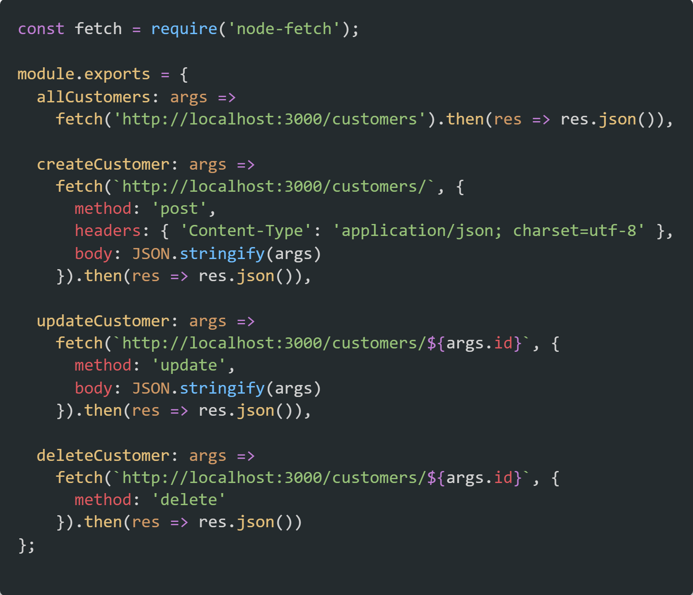
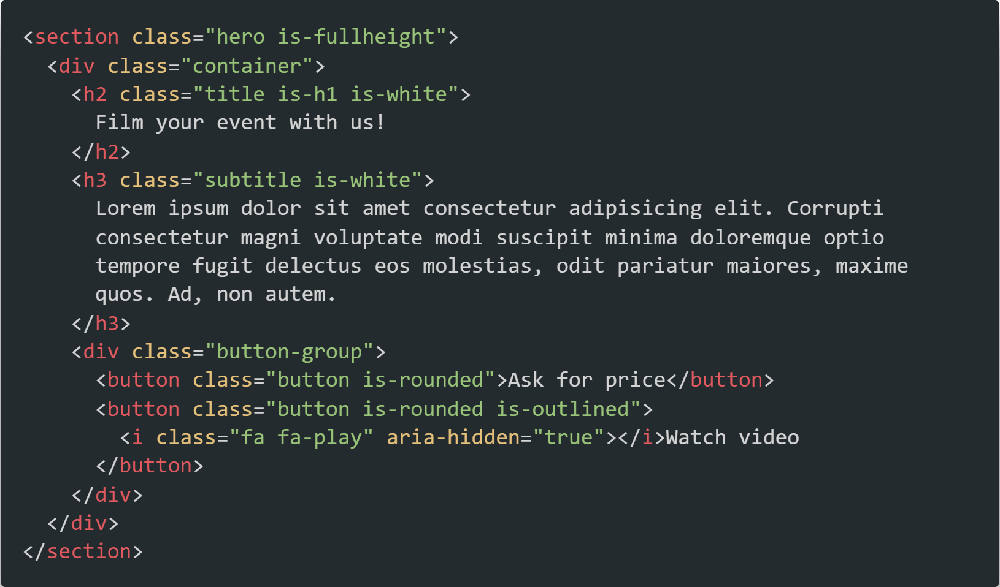
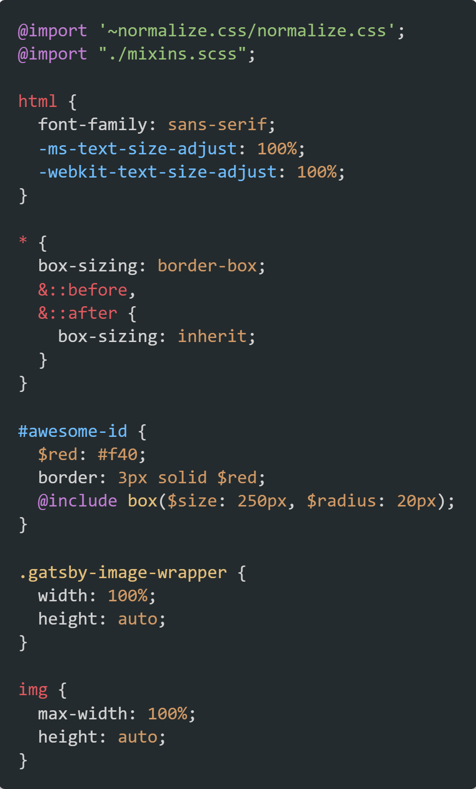

I developed this theme gradually over the past year using [One Dark](https://github.com/atom/one-dark-syntax) as a starting point. I began this project because, at the time, One Dark did not support C++ and I did find myself opening C++ in VS Code quite a lot.

After adding basic support for C++, I started playing with colors until I got a color pallette which I found easier on the eyes while still maintaining that flat and clean look of One Dark. Meanwhile I improved various aspects of the theme regarding styles' consistency across different languages.

## Color pallette

| Usage              | Hex Code                                                           |
| ------------------ | ------------------------------------------------------------------ |
| Background         |  `#242b2e` |
| Foreground         |  `#d4d4d4` |
| Comment            |  `#7f7f7f` |
| Keyword            |  `#c27fd6` |
| Variable           |  `#d4d4d4` |
| Constant           |  `#d19a66` |
| String             |  `#98c379` |
| Escaped character  |  `#5fb3b3` |
| Function           |  `#e5c07b` |
| Support            |  `#70beff` |
| Function arguments |  `#d19a66` |
| Class              |  `#e5c07b` |
| Operator           |  `#c27fd6` |
| Object property    |  `#e15a60` |
| Tag                |  `#e15a60` |
| Attribute          |  `#e5c07b` |

## Screenshots

### JavaScript

### HTML

### CSS

If you want to see a list of all the supported languages, as well as more screenshots checkout [this project's repo](https://github.com/ThisNameWasTaken/one-moon) on github.
